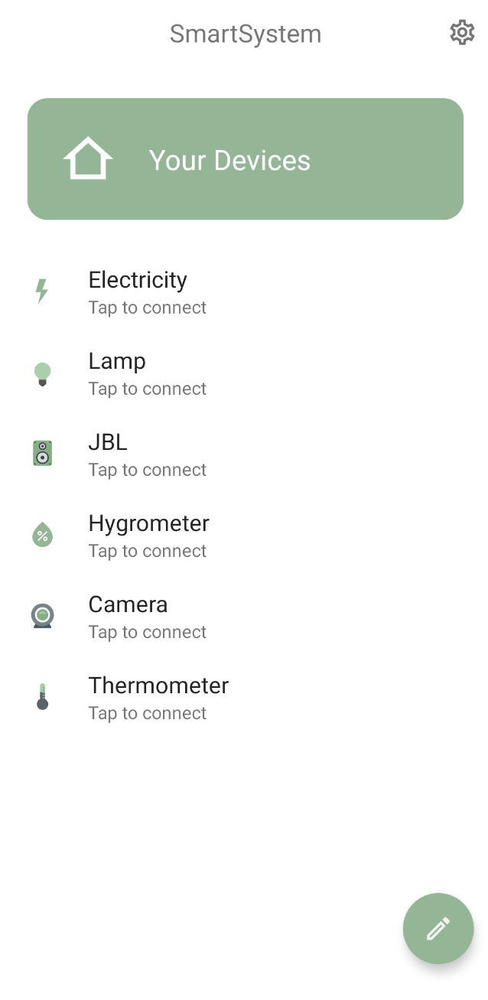
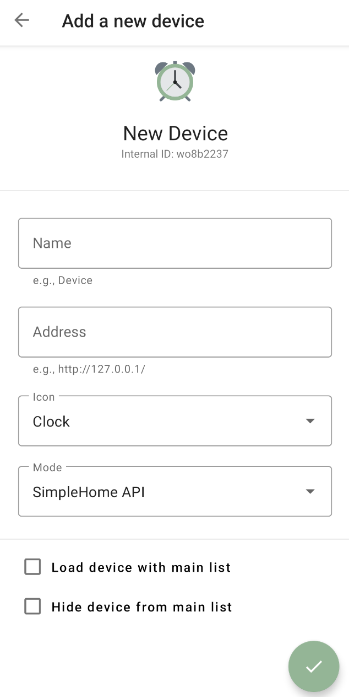

 

## About
Smart System это небольшое и простое в использовании приложение для умного дома с простой структурой. 
Цель этого приложения — сделать удаленное выполнение функций максимально простым и удобным для пользователя, 
чтобы помочь вам начать работу с технологией умного дома.

## Supported devices
Smart System поддерживает следующие девайсы:

- Philips Hue Bridge
- Shelly
- Devices using ESP Easy
- Devices using Tasmota
- Devices using the SimpleHome API

## Demo Screenshots

